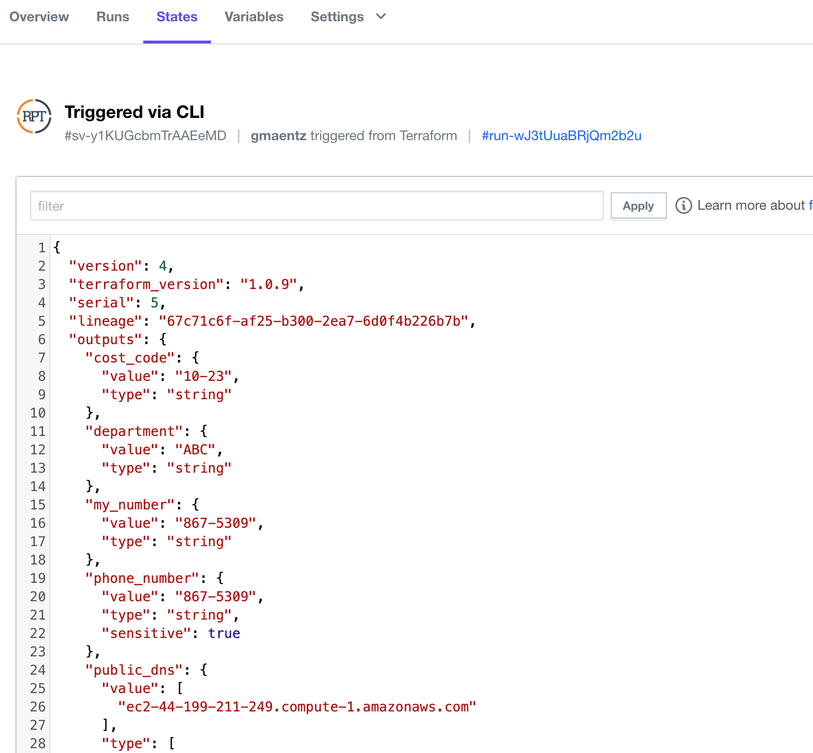

# Lab: Variable Validation and Suppression

We may want to validate and possibly suppress and sensitive information defined within our variables.

- Task 1: Validate variables in Terraform Configuration
- Task 2: Suppress sensitive information
- Task 3: View the Terraform state file

## Task 1: Valdiate variables in Terraform Configuration

### Create the base Terraform Configuration

Change directory into a folder specific to this challenge.

For example: `cd /workstation/terraform/azure/variable-validation/`.

We will start with a few of the basic resources needed.

### Create Variables

Create a file `variables.tf` and add the following configuration:

```hcl
variable "resource_group_name" {}
variable "EnvironmentTag" {}
variable "prefix" {}
variable "location" {
  default = "East US"
}
variable "computer_name" {}
variable "admin_username" {}
variable "admin_password" {}
variable "num_vms" {
  default = 2
}

variable "vm_size" {
  type        = string
  description = "Server Size"
  default     = "Standard_F2"

  validation {
    condition     = contains(["Standard_F2", "Standard_A2", "Standard_DS1_v2"], var.vm_size)
    error_message = "You must use an approved operating system. Options are Standard_A2, Standard_DS1_v2 or Standard_F2."
  }
}
```

### Update `main.tf` File

```hcl
provider "azurerm" {
  features {}
}

resource "azurerm_resource_group" "training" {
  name     = var.resource_group_name
  location = var.location
}

resource "azurerm_virtual_network" "training" {
  name                = "azureuser${var.prefix}vn"
  address_space       = ["10.0.0.0/16"]
  location            = azurerm_resource_group.training.location
  resource_group_name = azurerm_resource_group.training.name
}

resource "azurerm_subnet" "training" {
  name                 = "azureuser${var.prefix}sub"
  resource_group_name  = azurerm_resource_group.training.name
  virtual_network_name = azurerm_virtual_network.training.name
  address_prefixes     = ["10.0.2.0/24"]
}


resource "azurerm_public_ip" "training" {
  count                   = var.num_vms
  name                    = "azureuser${var.prefix}ip-${count.index + 1}"
  location                = azurerm_resource_group.training.location
  resource_group_name     = azurerm_resource_group.training.name
  allocation_method       = "Dynamic"
  idle_timeout_in_minutes = 30
  domain_name_label       = "azureuser${var.prefix}domain${count.index + 1}"
}

resource "azurerm_network_interface" "training" {
  count               = var.num_vms
  name                = "azureuser${var.prefix}ni-${count.index + 1}"
  location            = azurerm_resource_group.training.location
  resource_group_name = azurerm_resource_group.training.name

  ip_configuration {
    name                          = "azureuser${var.prefix}ip"
    subnet_id                     = azurerm_subnet.training.id
    private_ip_address_allocation = "dynamic"
    public_ip_address_id          = azurerm_public_ip.training[count.index].id
  }
}

resource "azurerm_virtual_machine" "training" {
  count                 = var.num_vms
  name                  = "${var.prefix}vm-${count.index + 1}"
  location              = azurerm_resource_group.training.location
  resource_group_name   = azurerm_resource_group.training.name
  network_interface_ids = [azurerm_network_interface.training[count.index].id]
  vm_size               = var.vm_size

  delete_os_disk_on_termination    = true
  delete_data_disks_on_termination = true

  storage_image_reference {
    publisher = "Canonical"
    offer     = "UbuntuServer"
    sku       = "18.04-LTS"
    version   = "latest"
  }
  storage_os_disk {
    name              = "${var.prefix}disk-${count.index + 1}"
    caching           = "ReadWrite"
    create_option     = "FromImage"
    managed_disk_type = "Standard_LRS"
  }
  os_profile {
    computer_name  = var.computer_name
    admin_username = var.admin_username
    admin_password = var.admin_password
  }

  os_profile_linux_config {
    disable_password_authentication = false
  }

  tags = {
    environment = var.EnvironmentTag
  }
}
```

### Create Variables TFVARS File

Create a file `terraform.tfvars` and add the following configuration and change out the ### with your initials.

```hcl
resource_group_name = "###-resourcegroup-var-validate"
EnvironmentTag      = "staging"
prefix              = "ghm"
location            = "East US"
computer_name       = "myserver"
admin_username      = "testadmin"
admin_password      = "Password1234!"
vm_size             = "Standard_A2"
num_vms             = 1
```

```bash
terraform plan
```

Now run a plan with a VM Size that is not approved:

```bash
terraform plan -var vm_size=Standard_GS1
```

```bash
Initializing Terraform configuration...

╷
│ Error: Invalid value for variable
│ 
│   on variables.tf line 14:
│   14: variable "vm_size" {
│ 
│ You must use an approved operating system. Options are Standard_A2, Standard_DS1_v2 or Standard_F2.
│ 
│ This was checked by the validation rule at variables.tf:19,3-13.

```

Now run a plan with a VM Size that is approved:

```bash
terraform plan -var vm_size=Standard_A2
```

## Task 2: Suppress sensitive information

Terraform allows us to mark variables as sensitive and suppress that information. Create `contactinfo.tf`

`contactinfo.tf`

```hcl
variable "department" {
    type = string

    validation {
        condition = length(var.department) == 3
        error_message = "Department length must be 3 characters."
    }
}

variable "cost_code" {
    type = string
    validation {
        condition = can(regex("^(?:[0-9]{1,2}\\-){2}[0-9]{1,2}$", var.cost_code))
        error_message = "Must be an cost code address of the form X-X-X."
    }
}

variable "phone_number" {
  type = string
  sensitive = true
  default = "867-5309"
}

locals {
  contact_info = {
      department = var.department
      cost_code = var.cost_code
      phone_number = var.phone_number
  }

  my_number = nonsensitive(var.phone_number)
}

output "department" {
  value = local.contact_info.department
}

output "cost_code" {
  value = local.contact_info.cost_code
}

output "phone_number" {
  value = local.contact_info.phone_number
}

output "my_number" {
  value = local.my_number
}
```

`terraform.auto.tfvars`

```hcl
department = "ABC"
cost_code  = "1-3-4"
```

Execute a `terraform apply` with the variables in the `terraform.auto.tfvars`.

```bash
terraform apply
```

You will notice that the output block errors as it needs to have the `sensitive = true` value set.

```bash
╷
│ Error: Output refers to sensitive values
│
│   on variables.tf line 73:
│   73: output "phone_number" {
│
│ To reduce the risk of accidentally exporting sensitive data that was intended to be only internal, Terraform requires that any root module output containing
│ sensitive data be explicitly marked as sensitive, to confirm your intent.
│
│ If you do intend to export this data, annotate the output value as sensitive by adding the following argument:
│     sensitive = true
╵
```

Update the output to set the `sensitive = true` attribute and rerun the apply.

```hcl
output "phone_number" {
  sensitive = true
  value = local.contact_info.phone_number
}
```

```bash
terraform apply
```

```bash
Outputs:

cost_code = "1-3-4"
department = "ABC"
my_number = "867-5309"
phone_number = <sensitive>
```

## Task 4: View the Terraform State File

Even though items are marked as sensitive within the Terraform configuration, they are stored within the Terraform state file. It is therefore critical to limit the access to the Terraform state file.

View the most current terraform state file on the `States` tab within Terraform Cloud


```json
{
 {
  "version": 4,
  "terraform_version": "1.0.9",
  "serial": 5,
  "lineage": "67c71c6f-af25-b300-2ea7-6d0f4b226b7b",
  "outputs": {
    "cost_code": {
      "value": "1-3-4",
      "type": "string"
    },
    "department": {
      "value": "ABC",
      "type": "string"
    },
    "my_number": {
      "value": "867-5309",
      "type": "string"
    },
    "phone_number": {
      "value": "867-5309",
      "type": "string",
      "sensitive": true
    },
    ...
```
